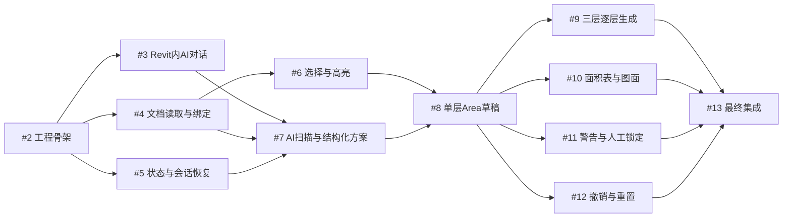

# 非专业开发人员双人Codex协同开发指南

## 1. 这份指南解决什么问题

本指南面向两位没有专业软件开发经验、但希望使用Codex共同完成Revit AI面积助手Demo的人。

读完后，你应该能够理解：

- 这个项目要做什么；
- GitHub、Codex、Issue、分支、Worktree和Pull Request分别是什么；
- 两个人应该怎样分工；
- 哪些Issue可以同时开发，哪些必须等待；
- 怎样让一个Codex领取一个Issue；
- Codex完成后怎样提交代码和创建Pull Request；
- 怎样让另一个Codex审查代码；
- 怎样在Revit中安全测试；
- 出现冲突或失败时怎么办；
- 哪些文件和信息绝对不能上传GitHub。

本文是当前项目的协作操作手册。产品需求以GitHub上的[父规格Issue #1](https://github.com/p645763368/revit-ai-area-assistant/issues/1)为准，每个开发任务以对应子Issue为准。

---

## 2. 项目要做什么

目标是在Revit 2026中制作一个“AI面积助手”Demo。

用户可以在Revit侧边面板中：

- 与AI对话；
- 选择Area Scheme；
- 勾选一层、商业二层和商业三层；
- 让AI读取模型和截图；
- 接收AI给出的结构化选项；
- 输入自由文本；
- 直接在Revit中选择Floor、Roof或Wall；
- 让AI生成Area Plan、Area Boundary、Area和Area Tag；
- 查看独立Demo面积表；
- 处理警告；
- 手工修改并锁定成果；
- 撤销最后一次AI写入；
- 在测试副本中重置Demo楼层。

当前只做Demo，不追求生产级完整插件。首要目标是证明：

```text
Revit内嵌界面
→ 本地Agent
→ 模型API
→ rvt-mcp
→ Revit模型写入
→ QA检查
→ 用户修正
```

这条完整链路可以跑通。

---

## 3. 两位参与者的建议角色

为了便于说明，本文使用“成员A”和“成员B”。两个人都可以使用Codex，不要求任何一位亲自编写代码。

### 成员A：项目负责人和Revit验收人

主要职责：

- 确认产品目标和建筑业务规则；
- 决定当前启动哪些Issue；
- 在Revit中打开正确的开发测试副本；
- 回答AI无法确定的面积边界和计容规则；
- 检查Area、Tag、颜色和面积表；
- 决定Pull Request是否可以合并。

### 成员B：协作负责人和第二审查人

主要职责：

- 领取独立Issue并让自己的Codex开发；
- 检查Issue的阻塞项是否已经完成；
- 审查成员A的Codex创建的Pull Request；
- 运行不依赖Revit的测试；
- 记录问题和复现步骤；
- 在成员A测试Revit时协助观察日志和结果。

这不是硬性分工。核心原则是：

> 写某个Issue的人，不应成为该Issue唯一的审查人。

---

## 4. GitHub和Codex分别做什么

GitHub不会自动运行Codex。GitHub是任务、代码和审查的共同记录中心；Codex是实际执行开发工作的AI。

| 名称 | 简单理解 | 在本项目中的作用 |
|---|---|---|
| Repository | 项目文件柜 | 保存源码、测试和文档 |
| Issue | 任务单 | 说明做什么、验收标准和依赖关系 |
| Codex Task | AI开发人员 | 领取一个Issue并写代码 |
| Branch | 独立修改线 | 保存某个Issue的修改 |
| Worktree | 独立办公桌 | 让多个Codex同时工作而不覆盖文件 |
| Commit | 一次有说明的保存 | 记录一组完成的代码修改 |
| Pull Request | 交作业并申请合并 | 展示改了什么、如何测试 |
| Review | 作业检查 | 检查代码质量和Issue符合度 |
| main | 当前正式基线 | 所有已经审查并合并的成果 |

整体流程：

```text
GitHub Issue
→ 一个Codex在独立Worktree开发
→ 提交Commit
→ 推送Branch
→ 创建Pull Request
→ 另一个Codex审查
→ 人工Revit验收（需要时）
→ 合并到main
→ Issue关闭
→ 后续被阻塞的Issue可以开始
```

---

## 5. 为什么必须使用独立Worktree

如果两个Codex在同一个本地文件夹工作，可能发生：

- 同时修改同一个文件；
- 一个Codex覆盖另一个Codex的内容；
- Git分支相互污染；
- 无法判断某段代码属于哪个Issue；
- 测试结果对应错版本。

因此每个Codex Task都应使用独立Worktree。

可以把Worktree理解为：Git为同一个仓库复制了一张独立办公桌。多个Codex共享GitHub仓库，但不直接共享正在编辑的文件夹。

创建Codex任务时应选择：

```text
同一个GitHub项目
+ 新建Worktree
+ 从最新main开始
```

不要选择多个任务共同直接操作同一个本地目录。

---

## 6. 一个Codex只负责一个Issue

每个Codex Task只处理一个GitHub Issue。

不推荐：

```text
一个Codex同时实现Issue #3、#4、#5
```

推荐：

```text
Codex A → Issue #3
Codex B → Issue #4
Codex C → Issue #5
```

这样做的好处：

- 工作范围清楚；
- 一个任务失败不会拖累其他任务；
- PR较小，容易审查；
- 更容易发现是谁改坏了什么；
- 更适合多Codex并行。

也不要让两个Codex同时领取同一个Issue。

---

## 7. 怎样知道Issue能不能开始

每个Issue底部都有“Blocked by”。

例如：

```text
Blocked by
- #2 建立可并行开发的工程骨架
```

表示必须先完成并关闭#2，才能开始这个Issue。

判断规则：

1. 打开准备领取的Issue；
2. 找到“Blocked by”；
3. 检查列出的Issue是否都已经Closed；
4. 确认对应PR已经合并到main；
5. 满足后才创建新的Codex Task。

`ready-for-agent`标签表示任务已经写清楚，适合Codex领取；它不代表阻塞项已经完成。

---

## 8. 当前12个Issue的正确开发顺序

父规格是[#1 AI面积助手Demo产品与技术规格](https://github.com/p645763368/revit-ai-area-assistant/issues/1)，不要关闭或把它当成普通开发任务。

### 波次一：只能先做#2

- [#2 建立可并行开发的工程骨架](https://github.com/p645763368/revit-ai-area-assistant/issues/2)

当前仓库处于初始阶段。#2没有完成前，不启动其他开发Issue。

### 波次二：#3、#4、#5可以并行

#2合并后，可以同时启动：

- [#3 跑通Revit内AI对话](https://github.com/p645763368/revit-ai-area-assistant/issues/3)
- [#4 跑通Revit文档读取与安全绑定](https://github.com/p645763368/revit-ai-area-assistant/issues/4)
- [#5 跑通外部状态、日志与会话恢复](https://github.com/p645763368/revit-ai-area-assistant/issues/5)

两个人可以这样安排：

| 人员 | Codex任务 |
|---|---|
| 成员A | 启动一个Codex负责#3，再启动一个Codex负责#5 |
| 成员B | 启动一个Codex负责#4 |

如果同时管理三个任务太困难，也可以先并行两个，完成后再做第三个。并行不是越多越好。

### 波次三：#6和#7

- [#6 Revit选择与高亮](https://github.com/p645763368/revit-ai-area-assistant/issues/6)：#4完成后可开始。
- [#7 AI扫描、截图与结构化方案](https://github.com/p645763368/revit-ai-area-assistant/issues/7)：#3、#4、#5全部完成后可开始。

#6和#7大部分工作可以并行。最后集成时，#7应使用#6定义的元素选择结果，而不是复制#6内部实现。

### 波次四：关键任务#8

- [#8 从空白楼层生成原子化Area草稿](https://github.com/p645763368/revit-ai-area-assistant/issues/8)

#8必须等待#6和#7都完成。

这个Issue涉及真实Revit写入，是项目关键路径。建议：

- 只启动一个主要Codex负责；
- 另一个人负责审查和Revit验收；
- 不允许多个Agent同时修改测试RVT。

### 波次五：#9、#10、#11、#12可以并行

#8合并后，可以同时启动：

- [#9 三层逐层生成](https://github.com/p645763368/revit-ai-area-assistant/issues/9)
- [#10 Demo面积表与图面表达](https://github.com/p645763368/revit-ai-area-assistant/issues/10)
- [#11 警告、人工锁定与局部修正](https://github.com/p645763368/revit-ai-area-assistant/issues/11)
- [#12 撤销、失败回滚和Demo重置](https://github.com/p645763368/revit-ai-area-assistant/issues/12)

建议分工：

| 人员 | Codex任务 |
|---|---|
| 成员A | #9、#11 |
| 成员B | #10、#12 |

每个人可以让两个Codex分别工作，但不要让两个Codex共用一个Worktree。

### 波次六：最终#13

- [#13 完成三层端到端Demo和性能验收](https://github.com/p645763368/revit-ai-area-assistant/issues/13)

#13必须等待#9、#10、#11和#12全部合并。

#13主要负责整合、修复冲突和最终测试，不应重新实现前面的所有功能。

### 依赖图



---

## 9. 两人协作的推荐工作计划

| 周期 | 主要工作 | 可同时运行的Codex | 预计时间 |
|---|---|---:|---:|
| 第1阶段 | #2工程骨架 | 1个 | 约1天 |
| 第2阶段 | #3、#4、#5 | 2至3个 | 约1.5至3天 |
| 第3阶段 | #6、#7 | 2个 | 约1.5至3天 |
| 第4阶段 | #8单层核心闭环 | 1个主Agent | 约3至5天 |
| 第5阶段 | #9、#10、#11、#12 | 最多4个 | 约2至4天 |
| 第6阶段 | #13集成验收 | 1个主Agent | 约2至3天 |

预计日历时间约2至3周。考虑Revit真机问题和返工，建议预留到3至5周。

---

## 10. 开始一个Issue前的检查清单

开始前逐项确认：

- [ ] 已经阅读父规格Issue #1。
- [ ] 已经阅读准备领取的Issue全文。
- [ ] Issue中的所有Blocked by都已关闭。
- [ ] 阻塞Issue对应PR已合并到main。
- [ ] 没有其他人或Codex正在做同一个Issue。
- [ ] 将在独立Worktree中工作。
- [ ] Worktree基于最新main。
- [ ] 清楚本Issue是否需要Revit真机测试。
- [ ] 不会上传RVT、密钥或项目数据。

建议在Issue中留言：

```text
成员A已领取，本任务由Codex Task“issue-3-ai-chat”开发。
预计完成后提交Pull Request。
```

这样另一位参与者不会重复领取。

---

## 11. 让Codex实现Issue的提示词模板

把下面模板复制给新建的Codex Task，并替换Issue编号。

```text
请实现GitHub仓库 p645763368/revit-ai-area-assistant 的Issue #<编号>。

开始前：
1. 完整阅读父规格Issue #1。
2. 完整阅读当前Issue及其中的Blocked by。
3. 确认全部阻塞Issue已经关闭并合并到main。
4. 检查仓库README、开发约定和现有测试。

开发要求：
1. 从最新main创建独立Git worktree和独立分支。
2. 一个Codex任务只实现当前Issue。
3. 不提前实现其他Ticket。
4. 遵守现有共享通信契约；如必须修改公共契约，先说明影响。
5. 优先测试用户可见行为，不为实现细节写脆弱测试。
6. 不提交RVT、API密钥、项目截图、运行日志或真实项目数据。
7. 涉及Revit写入时，只允许开发测试副本，禁止自动保存。

完成要求：
1. 运行适用的自动测试。
2. 记录仍需人工执行的Revit测试。
3. 提交代码并推送分支。
4. 创建Pull Request。
5. PR正文包含：Closes #<编号> 和 Refs #1。
6. 在PR中说明做了什么、如何测试、风险和未完成项。

不要直接合并PR。等待另一位参与者或审查Codex确认。
```

---

## 12. Pull Request是什么

Pull Request简称PR，可以理解为：

> Codex完成一个Issue后，把独立分支中的代码交给项目负责人检查，并申请合并到main。

PR页面会显示：

- 改了哪些文件；
- 每一行增加或删除了什么；
- 自动测试是否通过；
- 审查意见；
- 是否存在合并冲突；
- 是否可以Merge。

不要让Codex直接把未审查代码推入main。

---

## 13. Pull Request正文模板

```markdown
## 对应任务

Closes #<子Issue编号>
Refs #1

## 完成内容

- 完成了什么用户可见功能
- 修改了哪些主要模块
- 没有包含哪些范围外内容

## 自动测试

- 执行了哪些测试
- 测试结果

## Revit人工测试

- 是否需要Revit 2026
- 应打开哪个测试副本
- 操作步骤
- 预期结果
- 是否修改模型
- 是否保存模型

## 风险和限制

- 当前已知限制
- 后续Issue需要处理的内容

## 安全检查

- [ ] 未提交RVT
- [ ] 未提交API密钥
- [ ] 未提交项目截图和运行日志
- [ ] 未自动保存Revit模型
```

`Closes #编号`表示这个PR合并后，GitHub自动关闭对应Issue。

`Refs #1`表示这个PR与父规格有关，但不会关闭父规格Issue。

---

## 14. 让另一个Codex审查PR的提示词

```text
请审查GitHub仓库 p645763368/revit-ai-area-assistant 的Pull Request #<PR编号>。

完整阅读：
1. 父规格Issue #1；
2. PR对应的子Issue；
3. PR全部改动；
4. 仓库的开发规范和测试说明。

请沿两个方向审查：
1. Standards：代码是否符合仓库约定、安全边界和测试要求；
2. Spec：是否完整满足对应Issue，是否越界实现其他Ticket。

重点检查：
- 是否提交RVT、API密钥、日志、截图或真实项目数据；
- 是否修改了共享契约并影响其他并行任务；
- 是否在错误文档中可能执行Revit写入；
- 是否可能自动保存RVT；
- 测试是否验证外部行为；
- Issue中的每条验收标准是否有证据。

输出：
1. 阻断合并的问题；
2. 非阻断建议；
3. 仍需执行的Revit人工测试；
4. 最终结论：可以合并 / 修复后再审查。

本轮只做审查，不直接修改代码，除非我另行要求。
```

如果Codex中提供`code-review`技能，可以明确要求使用它。

---

## 15. 让Codex修复审查问题的提示词

```text
请继续处理Pull Request #<PR编号>的审查意见。

要求：
1. 逐条阅读所有未解决评论；
2. 只修复与当前Issue有关的问题；
3. 不借机扩大功能范围；
4. 修改后重新运行测试；
5. 推送到原PR分支，不创建重复PR；
6. 在PR中逐条回复修复结果和测试证据；
7. 不要自行合并。
```

---

## 16. 合并PR前的人工检查

由未编写该Issue的另一位参与者检查：

- [ ] 对应Issue编号正确。
- [ ] PR包含`Closes #子Issue`和`Refs #1`。
- [ ] Issue验收项都有对应说明或测试。
- [ ] 自动测试通过。
- [ ] 没有未解决的阻断审查意见。
- [ ] 没有提交RVT、密钥、日志和真实项目数据。
- [ ] 需要Revit测试时已经完成。
- [ ] 没有自动保存RVT。
- [ ] PR没有越界实现其他Issue。
- [ ] 与最新main没有未解决冲突。

满足后再点击Merge。

---

## 17. 多个PR怎样依次合并

并行开发完成后，不要四个PR同时直接合并。

推荐流程：

1. 选择接口影响最小、测试最完整的PR先合并；
2. 其他PR的Codex将最新main同步进自己的分支；
3. 解决冲突；
4. 重新运行测试；
5. 再审查；
6. 依次合并下一项。

让Codex同步main的提示词：

```text
请把最新main同步到当前Issue分支。

要求：
1. 保留当前Issue已有修改；
2. 解决与已合并PR的冲突；
3. 不删除其他人已经合并的功能；
4. 重新运行完整相关测试；
5. 将结果推送到原PR；
6. 汇报冲突发生在哪里以及如何解决。
```

---

## 18. Revit真机测试必须排队

代码可以由多个Codex并行开发，但当前Spec规定：同一时间只操作一个Revit实例和一个文档。

因此真实Revit写入测试必须串行：

```text
Agent A申请测试
→ 成员A确认打开开发测试副本
→ 记录当前模型状态
→ 只允许Agent A连接和写入
→ 完成测试、截图和日志
→ 撤销或重置测试结果
→ Agent A退出测试
→ Agent B再开始
```

禁止两个Agent同时通过rvt-mcp向同一Revit模型写入。

开发测试模型必须是：

```text
Beijing Flower_梁亚鹏 - 开发测试副本_detached.rvt
```

每次写入前都要再次确认完整路径。不要只看Revit窗口标题。

---

## 19. Revit测试提示词模板

```text
请为当前Issue执行Revit人工验收。

安全步骤：
1. 先列出可用Revit目标；
2. 使用返回的四位年份连接并验证；
3. 读取当前文档完整路径、标题、活动视图和IsModified；
4. 必须确认目标是开发测试副本；
5. 如果不是测试副本，立即停止，不执行写入；
6. 只操作Issue授权的Area Scheme和楼层；
7. 不自动保存RVT；
8. 写入后回读模型数据、表格和视图结果；
9. 汇报写入前后IsModified状态；
10. 保存必要的测试证据，但不要提交真实项目截图到Git。

如果测试失败，自动回滚本轮事务并报告原因。
```

---

## 20. 两个人每天怎样配合

推荐每天只进行一次10至15分钟的简短同步：

### 开始工作时

两人共同确认：

- 哪些Issue已经关闭；
- 当前哪些Issue没有阻塞；
- 每个人领取哪个Issue；
- 今天是否需要Revit测试；
- 谁负责PR审查。

### 工作过程中

- 每个Codex只处理自己的Issue；
- 在Issue中留言任务已领取；
- 遇到共享接口变化，先在Issue或PR中说明；
- 不通过聊天口头约定重要技术变化，最终要写进GitHub。

### 结束工作时

- 检查新建PR；
- 记录自动测试结果；
- 记录尚未完成的Revit测试；
- 不合并有阻断问题的PR；
- 更新第二天可以启动的Issue。

---

## 21. 当前推荐的两人实际分工

| 阶段 | 成员A | 成员B |
|---|---|---|
| #2 | 让Codex实现#2 | 审查#2 PR |
| #3–#5 | 让Codex实现#3和#5 | 让Codex实现#4；交叉审查 |
| #6–#7 | 让Codex实现#7 | 让Codex实现#6；交叉审查 |
| #8 | 负责Revit业务验收 | 让主Codex实现；或反向分工 |
| #9–#12 | 让Codex实现#9和#11 | 让Codex实现#10和#12 |
| #13 | 让集成Codex处理 | 执行独立审查和测试记录 |

如果两人都不是专业开发人员，建议同一时间每人最多管理两个Codex Task。超过这个数量后，沟通和PR审查成本可能高于并行收益。

---

## 22. GitHub仓库保持Private

当前仓库应保持Private。

原因：

- 可能包含Revit接口和项目规则；
- Issue可能讨论真实建筑模型；
- 日志或截图可能意外包含敏感内容；
- 第三方模型API配置需要谨慎管理。

邀请第二个人的步骤：

1. 打开仓库；
2. 进入Settings；
3. 打开Collaborators；
4. 点击Add people；
5. 输入对方GitHub用户名；
6. 对方接受邀请。

个人账号下的Private仓库Collaborator通常具有读写能力，因此只邀请可信成员。

---

## 23. 绝对不能上传GitHub的内容

- `.rvt`模型文件；
- API密钥；
- `.env`真实配置；
- Authorization请求头；
- 真实运行日志；
- 项目截图；
- 临时捕获文件；
- `AI_Area_Assistant_Data`项目状态目录；
- Python虚拟环境；
- pyRevit缓存；
- 任何包含业主、项目或人员敏感信息的文件。

如果发现密钥已经提交：

1. 立即撤销密钥；
2. 生成新密钥；
3. 不要仅仅删除最新文件，因为密钥仍可能存在Git历史；
4. 暂停合并和部署；
5. 让Codex协助清理Git历史；
6. 完成后再次进行安全检查。

---

## 24. 常见问题

### 两个Codex可以同时修改同一个文件吗？

技术上可以，但不推荐。应通过Ticket #2建立的模块边界，尽量让并行Issue修改不同模块。如果确实需要修改共享契约，先由一个Issue扩展契约，其他Issue再使用。

### Issue完成是不是等于项目完成？

不是。Issue完成只说明一个小功能已合并。必须等到#13完成并通过三层端到端验收，Demo才算完成。

### Pull Request创建后可以直接Merge吗？

不可以。至少需要自动测试、另一个Codex审查，以及适用的Revit人工测试。

### Codex说“完成了”是否可信？

需要证据。至少检查：

- Commit；
- PR差异；
- 测试输出；
- Issue验收项；
- Revit回读结果；
- 模型是否自动保存。

### 被阻塞的Issue可以提前启动吗？

原则上不可以。提前启动会让Agent基于尚未稳定的接口开发，之后容易大规模返工。

### 是否可以把测试RVT放进Private仓库？

不建议。Private不等于适合保存所有项目资料。测试RVT应通过受控文件共享，或者只在指定测试电脑使用。

### GitHub发生合并冲突怎么办？

不要手工随意删除代码。让负责该PR的Codex同步最新main、解释冲突并重新测试，然后由另一位Codex再次审查。

### 两个人可以共用一个GitHub账号吗？

不建议。每个人使用自己的GitHub账号，才能明确Issue、Commit、PR和Review是谁完成的。

---

## 25. 本项目当前下一步

当前只启动：

- [Issue #2：建立可并行开发的工程骨架](https://github.com/p645763368/revit-ai-area-assistant/issues/2)

建议操作：

1. 成员A创建一个新的Codex Task；
2. 选择本GitHub仓库；
3. 使用独立Worktree；
4. 粘贴本文第11节提示词，将Issue编号填写为#2；
5. 成员B等待PR；
6. 成员B创建独立Codex审查PR；
7. 审查与测试通过后合并；
8. #2关闭后，再同时启动#3、#4和#5。

---

## 26. 最简协作口诀

如果只记住十句话，请记住：

1. GitHub Issue是任务单，Codex才是开发者。
2. 一个Codex只做一个Issue。
3. 每个Codex使用独立Worktree。
4. Blocked by没有全部关闭，就不要开始。
5. 每个Issue完成后都要创建PR。
6. 写代码的人不能成为唯一审查人。
7. PR测试通过后才能合并。
8. 多个Codex可以并行写代码，但Revit写入测试必须排队。
9. 永远不要提交RVT和API密钥。
10. 当前先做#2，完成后再并行#3、#4和#5。

